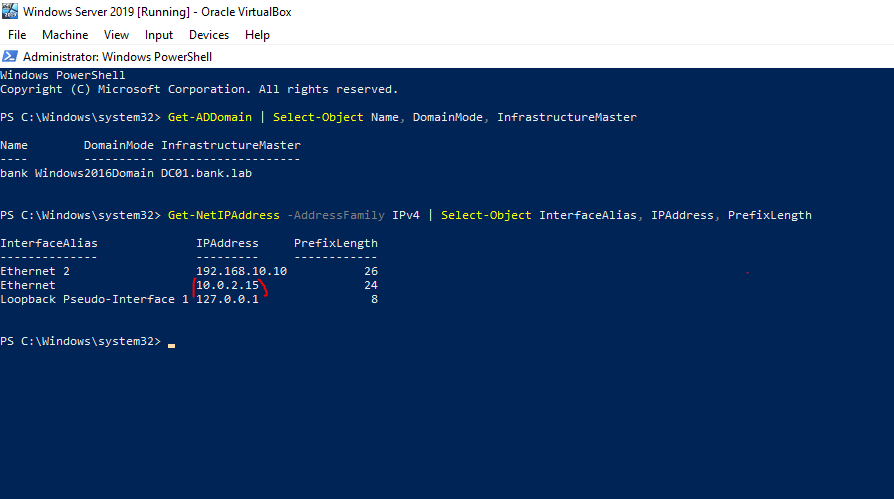

# 01 Enterprise Root CA + LDAPS

## Overview

In this lab, I deployed Active Directory Certificate Services (AD CS) in the existing `bank.lab` domain and configured an Enterprise Root Certification Authority named `BANK-ROOT-CA`. 

I then enrolled a Domain Controller certificate using the `Domain Controller Authentication` template and verified that the certificate was successfully installed on `DC01` with an associated private key.

Finally, I verified that `DC01` presents the expected certificate over TLS on port `636` and successfully performed an LDAP query through the LDAPS connection.


* * *


## Objectives

* Verify the Domain Controller and network configuration before deploying AD CS.
* Install and configure Active Directory Certificate Services.
* Configure an Enterprise Root Certification Authority integrated with Active Directory.
* Create a new CA private key and configure the CA cryptographic settings.
* Configure the Root CA name and certificate validity period.
* Verify that the AD CS service and Certification Authority are working correctly.
* Request and enroll a Domain Controller certificate using the `Domain Controller Authentication` template.
* Verify the issued certificate and its associated private key.
* Verify that the certificate contains the required server identity and Server Authentication EKU for LDAPS.
* Verify that the Domain Controller presents the expected certificate over TLS on port `636`.
* Perform an actual LDAP query through the encrypted LDAPS connection.

* * *

## Deployment

### 1. Domain Controller Pre-Check

Before deploying AD CS, I first verified the existing Domain Controller and network configuration.

The Enterprise CA integrates with Active Directory and depends on Active Directory and DNS for information such as CA configuration, certificate templates, and certificate enrollment.

Because of this, I wanted to check the current domain and network configuration before making changes.

I used the following PowerShell command to verify the domain:

```powershell
Get-ADDomain | Select-Object Name, DomainMode, InfrastructureMaster


I also checked the IPv4 network configuration:


Get-NetIPAddress -AddressFamily IPv4 |
Select-Object InterfaceAlias, IPAddress, PrefixLength
```




The domain was successfully identified as `bank.lab`.

The network configuration also showed an additional NAT interface with the IP address `10.0.2.15`.

Since Internet access was not required for this stage of the lab, I removed the NAT adapter and continued using only the internal network interface.

This simplified the network configuration and reduced the possibility of unnecessary DNS registration or name-resolution conflicts during the AD CS and LDAPS configuration.

---

### 2. Installing Active Directory Certificate Services

The next step was to install the Active Directory Certificate Services role.

I opened **Server Manager** and selected:

`Add Roles and Features`

I continued through the wizard until reaching the **Server Roles** section, where I selected:

`Active Directory Certificate Services`


I then continued to the **Role Services** section and selected:

`Certification Authority`


I selected the Certification Authority role service because this is the component required for the lab to implement the Certification Authority and issue digital certificates.

The CA acts as the trusted authority in the PKI environment and is responsible for issuing and signing certificates for systems and services.

---

### 3. Post-Deployment Configuration

After the AD CS role installation was completed, Server Manager displayed a notification for:

`Post-deployment Configuration`


I started the AD CS configuration wizard to configure the Certification Authority.

---

### 4. Configuring the CA Setup Type

For the **Setup Type**, I selected:

`Enterprise CA`


I selected an Enterprise CA because this lab already uses an Active Directory domain.

An Enterprise CA integrates with Active Directory and uses Active Directory for certificate templates, CA information, and certificate enrollment.

This provides the domain-based certificate management capabilities required for this lab.

---

### 5. Configuring the CA Type

For the **CA Type**, I selected:

`Root CA`


This is a new PKI environment, so I created a Root CA directly instead of using an existing external or subordinate CA.

The Root CA acts as the trust anchor of the PKI hierarchy. Its certificate is self-signed and can be used to establish trust for certificates issued by the CA.

---

### 6. Creating the CA Private Key

For the private key configuration, I selected:

`Create a new private key`

Because this is a new CA deployment, there was no existing CA private key to reuse.

---

### 7. Configuring CA Cryptography

For the cryptographic configuration, I selected:

- **Provider:** Microsoft Software Key Storage Provider
    
- **Key Length:** RSA 2048
    
- **Hash Algorithm:** SHA-256
    


I selected the Microsoft Software Key Storage Provider for the CA key storage and used RSA 2048 as the key length.

I also selected SHA-256 as the hash algorithm used when signing certificates issued by the CA.

These settings provide an appropriate cryptographic configuration for this lab environment.

---

### 8. Configuring the CA Name and Validity Period

For the CA Common Name, I changed the default name to:

`BANK-ROOT-CA`

I also changed the Root CA certificate validity period to:

`10 years`

I selected a longer validity period because this is the Root CA and it acts as the trust anchor for the PKI environment.

The Root CA certificate was therefore configured to remain valid from 2026 to 2036.

![[Configuration_Succeeded.PNG]]


---

### 9. Verifying the AD CS Installation

After completing the configuration, I used PowerShell to verify that the AD CS role was installed and that the Certification Authority service was running.

First, I checked the AD CS service:

```powershell
Get-Service CertSvc
```

This verifies the current state of the Certification Authority service.

I then verified that the Certification Authority role service was installed:

```powershell
Get-WindowsFeature ADCS-Cert-Authority
```

Finally, I used `certutil` to test the CA interface:

```powershell
certutil -config - -ping
```

The command successfully detected the configured CA:

```text
DC01.bank.lab\BANK-ROOT-CA
```

and returned:

```text
Server "BANK-ROOT-CA" ICertRequest2 interface is alive
CertUtil: -ping command completed successfully.
```


These checks confirmed that:

- The `CertSvc` service was running.
    
- The Certification Authority role service was installed.
    
- The CA request interface was responding successfully.
    

---

### 10. Verifying the Root CA Certificate

After confirming that the CA was working, I opened the **Certification Authority** console to verify the Root CA properties.

The CA was configured with the following settings:

- **CA Name:** `BANK-ROOT-CA`
    
- **Provider:** Microsoft Software Key Storage Provider
    
- **Hash Algorithm:** SHA-256
    
- **Validity Period:** 10 years
    

When opening the Root CA certificate details, the certificate was issued by:

`BANK-ROOT-CA`

This confirms that the certificate is a self-signed Root CA certificate.


---

### 11. Requesting a Domain Controller Certificate

After configuring the CA, I requested a certificate for the Domain Controller.

I opened the Local Computer certificate store using:

```text
Win + R → certlm.msc
```

I then navigated to:

`Personal → Certificates`

and selected:

`All Tasks → Request New Certificate...`

The certificate enrollment wizard displayed the available templates through the:

`Active Directory Enrollment Policy`

I selected:

`Domain Controller Authentication`

and clicked:

`Enroll`


This allowed `DC01` to request and enroll for a certificate from the Enterprise CA using the Active Directory enrollment policy.

The `Domain Controller Authentication` template provides certificate properties suitable for Domain Controller authentication scenarios and includes the Server Authentication capability required for services such as LDAPS.

---

### 12. Verifying the Certificates in the Local Computer Store

After completing the enrollment, I queried the Local Computer certificate store using PowerShell:

```powershell
Get-ChildItem Cert:\LocalMachine\My |
Select-Object Subject, Issuer, NotBefore, NotAfter, Thumbprint, HasPrivateKey
```


The certificate store contained three certificates.

The certificates included:

- The `BANK-ROOT-CA` Root CA certificate with a 10-year validity period.
    
- An existing Domain Controller certificate.
    
- The newly enrolled Domain Controller certificate.
    

The newly enrolled certificate could be identified by matching its enrollment date with the time when I performed the `Request New Certificate` and `Enroll` operation.

The important point at this stage is that the certificate was successfully enrolled into the Local Computer's Personal certificate store and had an associated private key.

---

### 13. Inspecting the Enrolled Certificate

I then inspected the complete information of the newly enrolled certificate using its thumbprint:

```powershell
Get-ChildItem Cert:\LocalMachine\My\BE56BE6D368D8EADAC64B48F86B7B12C99FCCA97 |
Format-List *
```


The certificate contained the properties required for the LDAPS configuration.

The important properties were:

- **DNS Name:** `DC01.bank.lab`
    
- **Enhanced Key Usage:** `Server Authentication`
    
- **HasPrivateKey:** `True`
    
- **Issuer:** `BANK-ROOT-CA`
    

The `DNS Name=DC01.bank.lab` value is provided through the **Subject Alternative Name (SAN)** extension and identifies the Domain Controller for TLS communication.

The `Server Authentication` EKU indicates that the certificate can be used for server authentication.

The `HasPrivateKey=True` value confirms that the private key associated with the certificate is available on the Domain Controller.

These properties indicate that the enrolled certificate is suitable for use by the Domain Controller for LDAPS.

---

### 14. Verifying the Certificate Presented by LDAPS

After verifying the certificate stored on the server, I tested the TLS connection to the LDAPS service on TCP port `636`.

I used PowerShell to establish a TLS connection and retrieve the certificate presented by `DC01`:

```powershell
$TcpClient = New-Object System.Net.Sockets.TcpClient("DC01.bank.lab", 636)

$SslStream = New-Object System.Net.Security.SslStream(
    $TcpClient.GetStream(),
    $false,
    { $true }
)

$SslStream.AuthenticateAsClient("DC01.bank.lab")

$SslStream.RemoteCertificate.GetCertHashString()

$SslStream.Dispose()
$TcpClient.Dispose()
```


The TLS connection returned the following certificate thumbprint:

```text
BE56BE6D368D8EADAC64B48F86B7B12C99FCCA97
```

This matched the thumbprint of the certificate previously identified in the Local Computer certificate store.

This confirms that `DC01` presents the expected certificate when establishing a TLS connection on port `636`.

The callback used in this test accepts the certificate without performing normal certificate validation. The purpose of this test is to identify the certificate presented by the server during the TLS connection.

---

### 15. Verifying LDAP over SSL

After confirming that the expected certificate was presented during the TLS connection, I performed an actual LDAP operation through the encrypted connection.

I used `.NET DirectoryServices` with the `SecureSocketsLayer` authentication type:

```powershell
$ldap = [System.DirectoryServices.DirectoryEntry]::new(
    "LDAP://DC01.bank.lab:636/RootDSE",
    "sahl.admin@bank.lab",
    "<MY-PASSWORD>",
    [System.DirectoryServices.AuthenticationTypes]::SecureSocketsLayer
)

$ldap.RefreshCache()

$ldap.Properties["defaultNamingContext"].Value
```


The query successfully returned:

```text
DC=bank,DC=lab
```

This confirms that an LDAP query was successfully performed through the SSL/TLS connection on port `636`.

At this point, the complete LDAPS workflow was demonstrated:

```text
AD CS Enterprise Root CA
        ↓
Certificate Enrollment
        ↓
Certificate installed on DC01
        ↓
Private Key available
        ↓
TLS connection on TCP 636
        ↓
Expected certificate presented
        ↓
LDAP query succeeds over SSL
```

This confirms that the Domain Controller is configured to provide LDAP communication over an encrypted TLS channel using the enrolled certificate.


