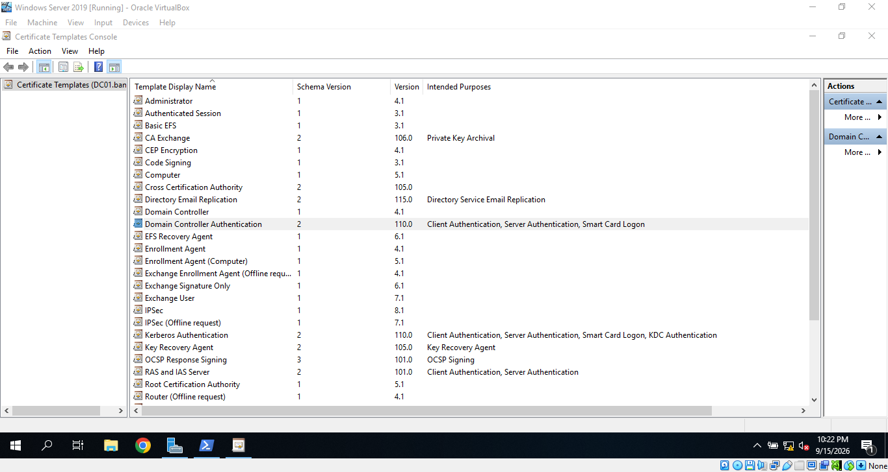
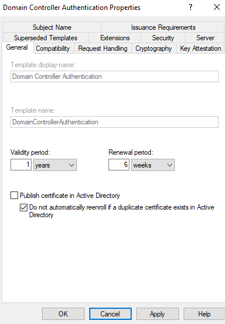
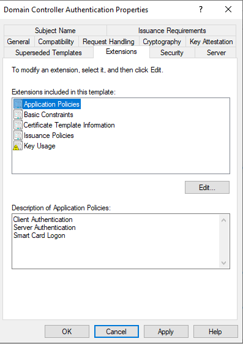
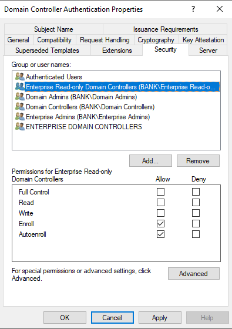
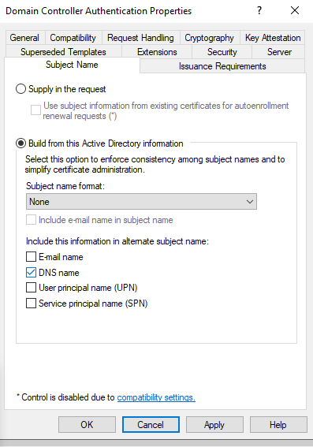
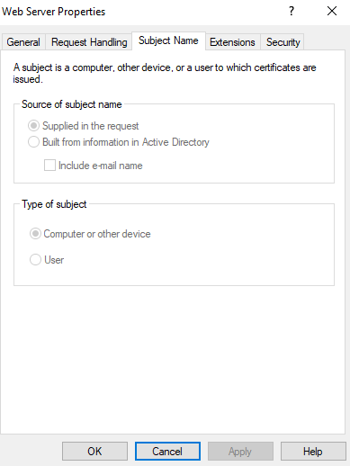
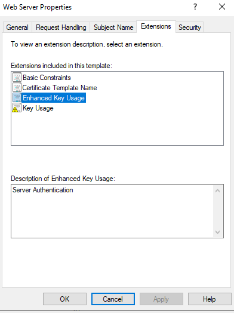
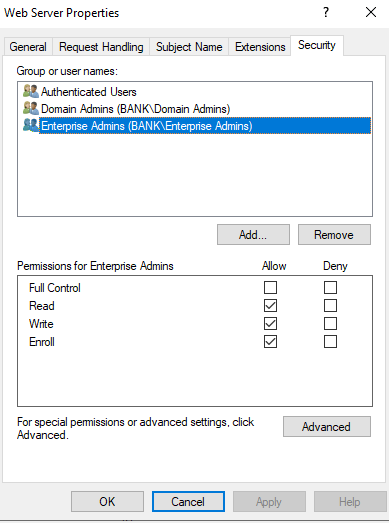

# 02 Certificate Templates

## Overview

In this lab, I explored the built-in Certificate Templates available in the existing Active Directory Certificate Services (AD CS) environment.

I first inspected the `Domain Controller Authentication` template to understand how a certificate template defines certificate validity, compatibility, certificate usage, enrollment permissions, subject identity, and issuance requirements.

I then compared the `Domain Controller Authentication` template with the `Web Server` template, focusing on three important areas: Enhanced Key Usage (EKU), Security, and Subject Name configuration.

The purpose of this comparison was to understand how different certificate templates are designed for different authentication and certificate usage scenarios.

* * *

## Objectives

* Explore the built-in Certificate Templates available in the AD CS environment.
* Inspect the configuration of the `Domain Controller Authentication` template.
* Understand the certificate validity and renewal periods defined by a template.
* Review the compatibility settings configured for the CA and certificate recipient.
* Understand how Enhanced Key Usage (EKU) defines the permitted purposes of an issued certificate.
* Review the security permissions that control access and enrollment from a certificate template.
* Understand how certificate identity information can be built from Active Directory.
* Review the issuance requirements configured in the template.
* Compare the `Domain Controller Authentication` and `Web Server` templates.
* Understand how EKU, Security, and Subject Name settings differ depending on the purpose of the certificate template.

* * *

## Deployment

### 1. Opening the Certificate Templates Console

I started by opening the Certificate Templates console using:

```text
certtmpl.msc
```

The console displayed the certificate templates available in the Active Directory environment.



I selected the `Domain Controller Authentication` template and opened its properties to inspect how the template was configured.

---

### 2. Reviewing the General Configuration

I first reviewed the **General** tab of the `Domain Controller Authentication` template.

The template was configured with:

- **Template Display Name:** `Domain Controller Authentication`
- **Validity Period:** `1 year`
- **Renewal Period:** `6 weeks`



The validity period defines how long a certificate issued from this template remains valid.

The renewal period defines the period before certificate expiration during which certificate renewal can begin. A renewal period of six weeks does not mean that the certificate is renewed every six weeks.

I also observed that the option preventing automatic reenrollment when a duplicate certificate already exists in Active Directory was enabled.

---

### 3. Reviewing Template Compatibility

The next tab I inspected was **Compatibility**.

The template was configured with:

- **Certification Authority:** `Windows Server 2003`
- **Certificate Recipient:** `Windows XP / Windows Server 2003`

These settings represent the minimum compatibility levels configured for the Certification Authority and certificate recipient.

The compatibility configuration is important because it affects which certificate template features are available based on the supported CA and recipient versions.

---

### 4. Reviewing the Application Policies

I then moved to the **Extensions** tab.

One of the most important extensions I reviewed was the Application Policies / Enhanced Key Usage configuration.

The `Domain Controller Authentication` template contained three authentication purposes:

- `Client Authentication`
- `Server Authentication`
- `Smart Card Logon`



Enhanced Key Usage defines what a certificate issued from the template is permitted to be used for.

The Domain Controller participates in multiple authentication scenarios, so the `Domain Controller Authentication` template includes multiple authentication purposes.

`Server Authentication` allows the certificate to be used when the Domain Controller authenticates itself as a server, such as during an LDAPS connection.

`Client Authentication` allows the certificate to be used in scenarios where the Domain Controller needs to authenticate itself as a client using certificate-based authentication.

`Smart Card Logon` supports the certificate requirements associated with Active Directory smart card authentication scenarios.

I also reviewed the **Key Usage** configuration, which included:

- Digital Signature
- Key exchange using key encryption
- Critical extension

---

### 5. Reviewing Template Security

The next important tab was **Security**.

This tab defines which security principals can access the template and what permissions they have.



The important permissions I observed included:

- **Authenticated Users:** Read
- **Read-only Domain Controllers:** Enroll, Autoenroll
- **Domain Admins:** Read, Write, Enroll
- **Domain Controllers:** Read, Enroll, Autoenroll
- **Enterprise Admins:** Read, Write, Enroll
- **Enterprise Domain Controllers:** Enroll, Autoenroll

The `Enroll` permission allows an eligible security principal to request a certificate using the template.

The `Autoenroll` permission allows the security principal to participate in automatic certificate enrollment when certificate auto-enrollment is configured.

The `Read` and `Write` permissions control access to the template and the ability to modify its configuration.

---

### 6. Reviewing the Subject Name Configuration

I then reviewed the **Subject Name** tab.

The `Domain Controller Authentication` template was configured to:

`Build from this Active Directory information`

The Subject Name format was configured as:

`None`

and the following identity information was selected:

`DNS name`



This configuration means that the certificate identity information is built using information already available in Active Directory instead of requiring the requester to manually provide the identity.

For a Domain Controller, Active Directory already contains information about the computer and its DNS identity.

This also explains the certificate behavior observed in the previous AD CS lab, where the enrolled Domain Controller certificate contained `DC01.bank.lab` as its DNS identity.

---

### 7. Reviewing Issuance Requirements

The final tab I reviewed was **Issuance Requirements**.

The template was configured with:

- **CA Certificate Manager Approval:** Not required
- **Authorized Signatures:** Not required

No additional approval or authorized signature requirements were configured for certificate issuance from this template.

At this point, I had reviewed the main properties of the `Domain Controller Authentication` template and understood how the template controls certificate usage, enrollment permissions, identity information, and issuance requirements.

---

### 8. Comparing with the Web Server Template

After inspecting the `Domain Controller Authentication` template, I wanted to determine whether another certificate template would use the same configuration.

I selected the built-in `Web Server` template and compared it with the `Domain Controller Authentication` template.

For this comparison, I focused on three important areas:

- Subject Name
- Extensions / Enhanced Key Usage
- Security

These three areas answer three important questions about a certificate template:

```text
Subject Name → Where does the certificate identity come from?

Enhanced Key Usage → What can the issued certificate be used for?

Security → Who can access or enroll from the template?
```

---

### 9. Comparing the Subject Name

The first important difference appeared in the **Subject Name** configuration.

Unlike the `Domain Controller Authentication` template, the `Web Server` template was configured as:

`Supply in the request`



In the `Domain Controller Authentication` template, the certificate identity is built using information from Active Directory.

In the `Web Server` template, the required certificate identity is instead supplied as part of the certificate request.

This difference is important because the identity of a web service does not always have to match the hostname of the computer hosting the service.

For example, a server could have the computer name:

```text
WEB01.bank.lab
```

while hosting a web service using the DNS name:

```text
portal.bank.lab
```

The certificate may therefore need to represent `portal.bank.lab` rather than only the computer name stored in Active Directory.

---

### 10. Comparing Enhanced Key Usage

I then reviewed the **Extensions** tab of the `Web Server` template.

The Basic Constraints extension identified the certificate as an end-entity certificate.

I then selected **Enhanced Key Usage** and found:

`Server Authentication`



This was an important difference from the `Domain Controller Authentication` template.

The Domain Controller Authentication template contained:

```text
Server Authentication
Client Authentication
Smart Card Logon
```

while the Web Server template contained:

```text
Server Authentication
```

This difference reflects the different purposes of the two templates.

A Domain Controller participates in multiple authentication scenarios, while the Web Server template is focused on allowing a server to authenticate itself to clients in server authentication scenarios such as TLS.

---

### 11. Comparing Template Security

Finally, I reviewed the **Security** configuration of the `Web Server` template.



The important permissions I observed included:

- **Authenticated Users:** Read
- **Domain Admins:** Read, Write, Enroll
- **Enterprise Admins:** Read, Write, Enroll

Unlike the `Domain Controller Authentication` template, I did not observe the `Autoenroll` permission assigned to the security principals reviewed in the Web Server template.

This comparison showed that certificate template security determines which security principals can access and enroll from a template and what level of permissions they have.

The comparison also demonstrated that the Security configuration must be considered together with the certificate purpose and Subject Name configuration rather than treating each template setting independently.

---

### 12. Certificate Template Comparison

After inspecting both templates, the main differences became clear.

| Property | Domain Controller Authentication | Web Server |
| --- | --- | --- |
| **Enhanced Key Usage** | Server Authentication, Client Authentication, Smart Card Logon | Server Authentication |
| **Subject Name** | Built from Active Directory information | Supplied in the request |
| **Identity Source** | Active Directory / DNS information | Certificate request |
| **Autoenroll** | Assigned to Domain Controller-related principals | Not assigned to the principals reviewed |
| **Primary Purpose** | Domain Controller authentication scenarios | Server authentication |

The comparison demonstrated that a Certificate Template is not a certificate itself.

Instead, the template acts as a policy that controls how certificates are requested and issued.

The three main properties I focused on can be summarized as:

```text
Certificate Template
        |
        +-- Enhanced Key Usage
        |       What can the issued certificate be used for?
        |
        +-- Security
        |       Who can access or enroll from the template?
        |
        +-- Subject Name
                Where does the certificate identity come from?
```

Understanding these differences provides the foundation for creating and configuring a custom certificate template in the next stage of the AD CS lab.
