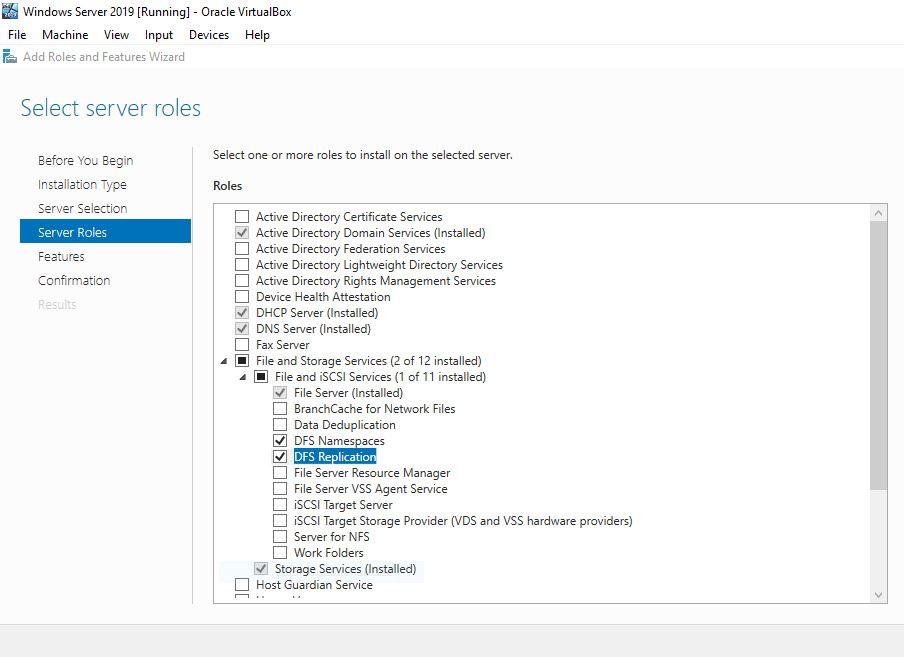
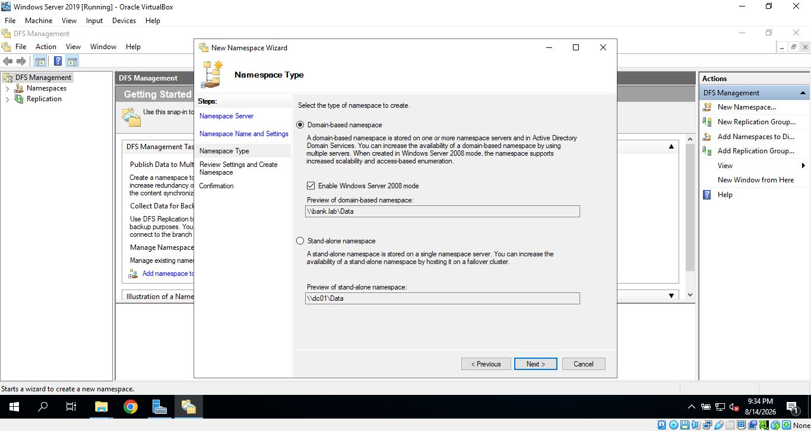
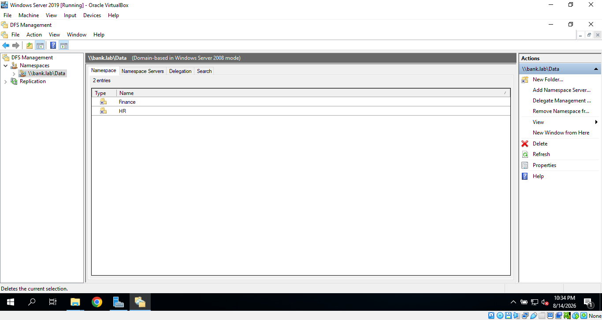

# Distributed File System (DFS)

  

## Overview

  

Distributed File System (DFS) is a Windows Server technology that provides a logical way to organize and access shared folders across a network.

  

In this lab, I focused on **DFS Namespaces** and created a domain-based namespace that provides users with a single logical path to access shared folders without needing to know the physical server hosting the data.

  

The lab also introduced the difference between **DFS Namespaces** and **DFS Replication**.

  

- **DFS Namespaces (DFS-N):** Provides a logical namespace and a unified path for accessing shared folders.

- **DFS Replication (DFS-R):** Synchronizes folder contents between multiple servers.

  

---

  

## Objectives

  

- Install the DFS role.

- Understand the difference between DFS Namespaces and DFS Replication.

- Create and configure a shared folder for use with DFS.

- Create a domain-based DFS namespace.

- Add a shared folder to the DFS namespace.

- Configure a folder target for the shared folder.

- Verify that a client computer can access the shared folder through the DFS namespace.

  

---

  
## Deployment

### Installing DFS

The first step was to install the DFS role on the Windows Server.

The DFS role includes two main components:

- **DFS Namespaces**
- **DFS Replication**

DFS Namespaces provides a logical way to organize and access shared folders through a unified network path.

DFS Replication is used to synchronize folder contents between multiple servers.



---

### Creating the DFS Namespace

After successfully installing the DFS role, I opened **DFS Management** from the **Tools** menu.

The first step was to understand the concept of a **DFS Namespace** and how it provides users with a logical path to access shared folders.

I selected **New Namespace**, specified the server, and then created a namespace named:

`Data`

The namespace is accessed by users through the following path:

`\\bank.lab\Data`

The purpose of this namespace is to provide users with a single logical path to access the shared folders published through DFS. Users do not need to know which server is hosting the actual folders.

---

### Selecting the Namespace Type

During the namespace configuration, I reviewed the two available namespace types:

1. **Domain-based namespace**
2. **Stand-alone namespace**



For this lab, I selected the **Domain-based namespace** because the lab environment is based on the `bank.lab` domain.

---

### DFS Management Console

After creating the namespace, I opened it in the **DFS Management** console.



The namespace was created successfully and was ready for adding folders.

---

### Adding the HR Folder

I then added a folder named **HR** to the DFS namespace.

The namespace path was:

`\\bank.lab\Data\HR`

I also configured the folder target where the actual folder is located:

`\\DC01\Shares\HR`

The configured paths are shown below:

```text
Namespace Path:
\\bank.lab\Data\HR

Folder Target:
\\DC01\Shares\HR
---
```

![[new_folder_HR_zoom.png]]


### Testing the DFS Namespace

After completing the configuration, I moved to the Windows 7 client and accessed the HR folder using the new DFS namespace path:

`\\bank.lab\Data\HR`

The folder was successfully accessible from the Windows 7 client.

![[HR_User_Folder.PNG]]

This confirmed that the DFS namespace was working correctly and that the client could access the configured folder through the DFS path.

---

This completed the practical implementation of the **DFS Namespace** in this lab.


## Challenges

The main limitation I encountered during this lab was that I could not implement **DFS Replication**.

DFS Replication requires multiple servers to provide a meaningful replication scenario. However, my lab environment only had one Windows Server, and I could not add a second server because the machine I was working on had limited resources.


## Lessons Learned


I learned that DFS can give users a simple logical path to their files without exposing the actual server and folder location.


Another lesson I learned is that hardware resources can make a big difference when building a virtualized enterprise lab.
