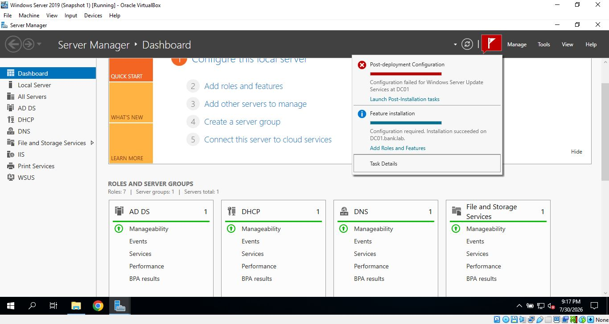
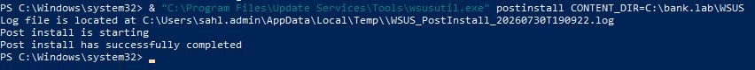
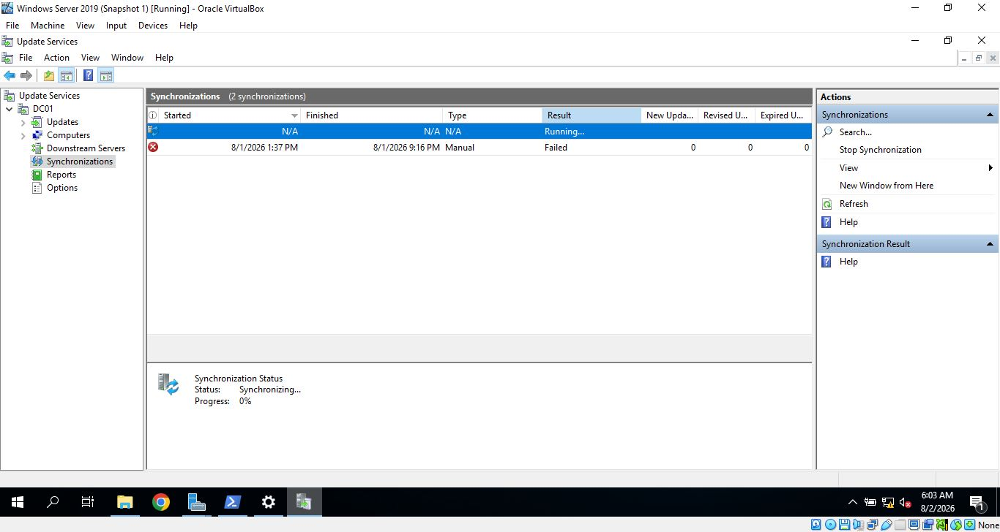
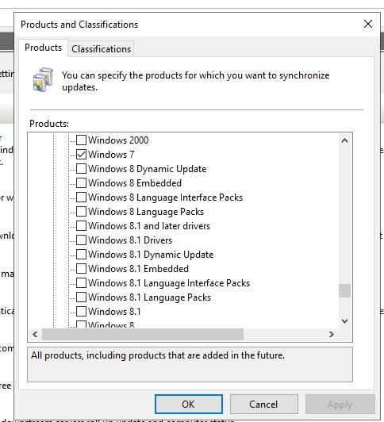
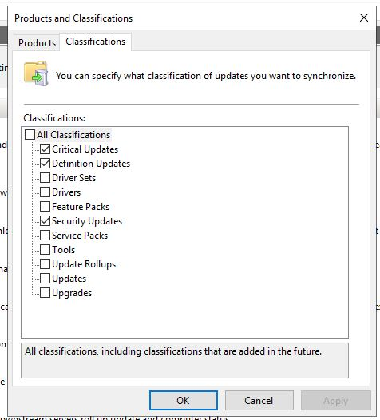
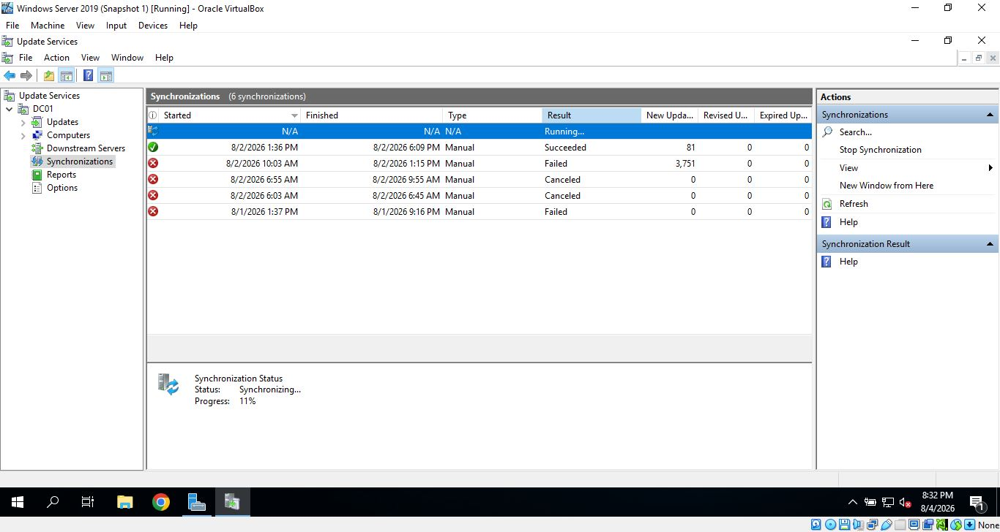
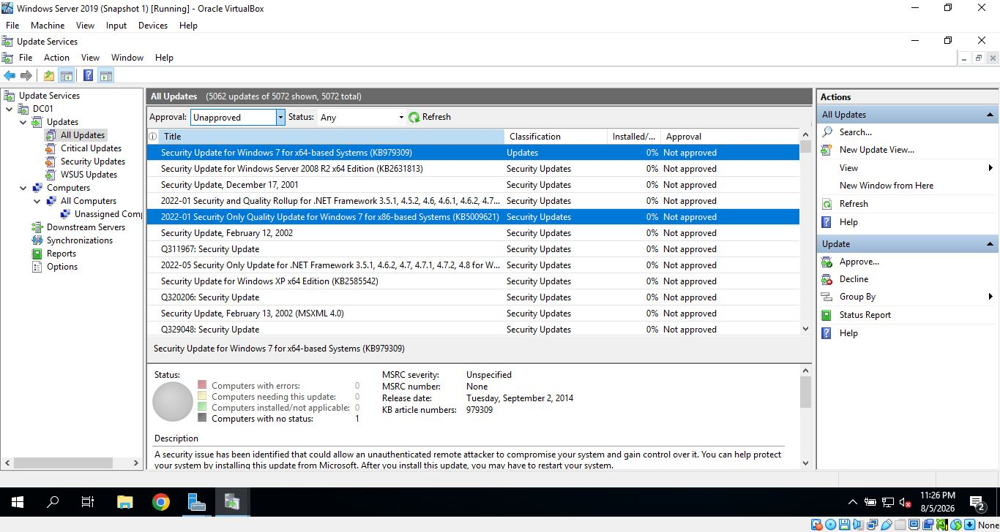
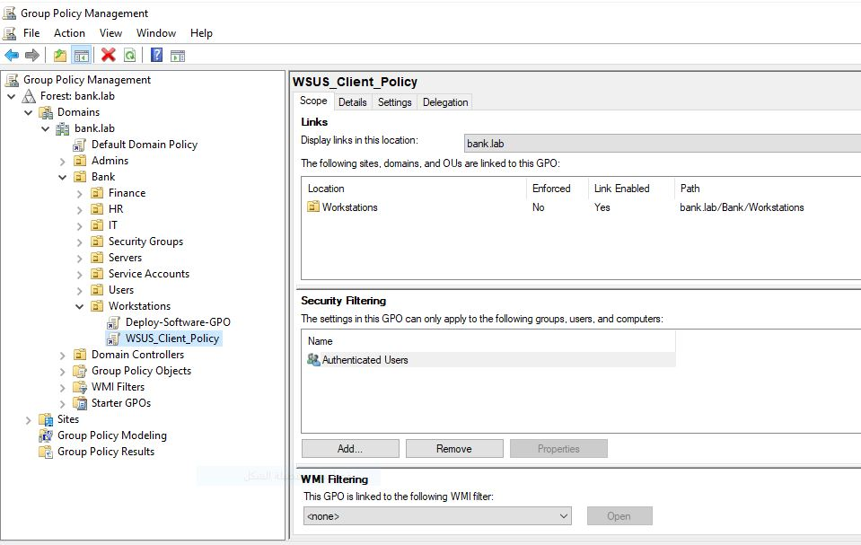

# Windows Server Update Services (WSUS)

## Overview

Windows Server Update Services (WSUS) is a Windows Server role that allows administrators to centrally manage and distribute Windows updates within an organization.

Instead of each client computer downloading updates directly from Microsoft, WSUS provides a centralized solution where updates can be synchronized, reviewed, and deployed to domain-joined computers.

---

## Objectives

- Install the WSUS role.
- Configure a dedicated content directory to store downloaded updates.
- Complete the WSUS post-installation configuration.
- Configure Group Policy to enable clients to receive updates from the WSUS server.
- Verify that client computers successfully communicate with WSUS and receive approved updates.

---

## Deployment

Installed the WSUS role using Server Manager.

During the installation of the WSUS service, I noticed that the IIS service was also installed.


Selected C:\bank.lab\WSUS as the content directory.


During the installation of the WSUS role, I noticed that IIS was also installed as part of the required components.

WSUS relies on IIS to communicate with client computers and deliver updates over the network.

In simple terms:

* **WSUS** is responsible for managing updates, synchronization, approvals, and reporting.
* **IIS** provides the web services used by client computers to communicate with the WSUS server and download updates.

So, WSUS manages the updates, while IIS provides the web-based communication and delivery mechanism between the WSUS server and its clients.


During the post-installation configuration, an error occurred.





I used this command via PowerShell to complete the setup, and it worked.





### Initial Synchronization

After installing WSUS, I opened the WSUS management console and performed the first synchronization with Microsoft Update.

This synchronization was needed to retrieve information about the available products and updates. After the synchronization, additional products, including **Windows 7**, became available for selection.





Throughout the WSUS synchronization and configuration process, I encountered several issues that required multiple attempts and additional troubleshooting. I will explain these issues and their solutions in the **Challenges** section.


### Selecting Products

After the initial synchronization, I went to the **Products** section and selected the products required for my lab.

For this lab, I only needed **Windows 7** and **Windows Server 2019**.




### Selecting Update Classifications

I also selected only **Security Updates** and **Critical Updates**.

I did this to reduce the amount of data downloaded and stored by WSUS and to make the synchronization process faster. The other classifications were not required for this lab.




### Synchronizing Selected Updates


After selecting the required products and classifications, I performed another synchronization to download the selected update information and updates from Microsoft Update.




### Reviewing Available Updates

After completing the synchronization, I went to the **Updates** section in the WSUS management console.

I changed the update status filter to **Any** to view all available updates.

The synchronized updates were then displayed in the console.




### Configuring Group Policy

Before approving the updates, I created a Group Policy Object (GPO) and linked it to the 
Organizational Unit (OU) named "workstations".




This allows the client computer to use the WSUS server as its update source and communicate with the WSUS server.


#### 🗂️ Group Policy Path

```text
Computer Configuration
└── Policies
    └── Administrative Templates
        └── Windows Components
            └── Windows Update
                ├── ⚙️ Specify intranet Microsoft update service location
                ├── ⚙️ Configure Automatic Updates
                └── ⚙️ No auto-restart with logged on users for scheduled automatic updates installations


###⚙️Configured Policy Details

Specify intranet Microsoft update service location: Set to Enabled with the server URL http://DC01:8530.

Configure Automatic Updates: Set to Enabled using option 3 - Auto download and notify for install.

No auto-restart with logged on users for scheduled automatic updates installations: Set to Enabled to prevent automatic reboots while users are logged in.


